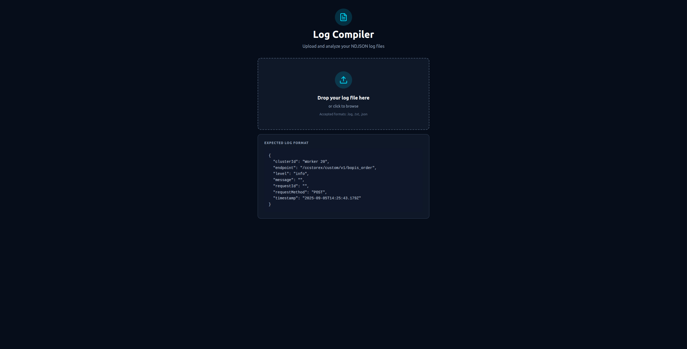
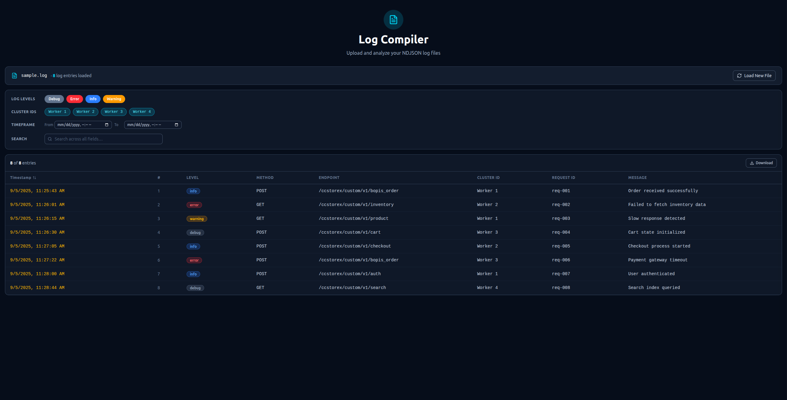
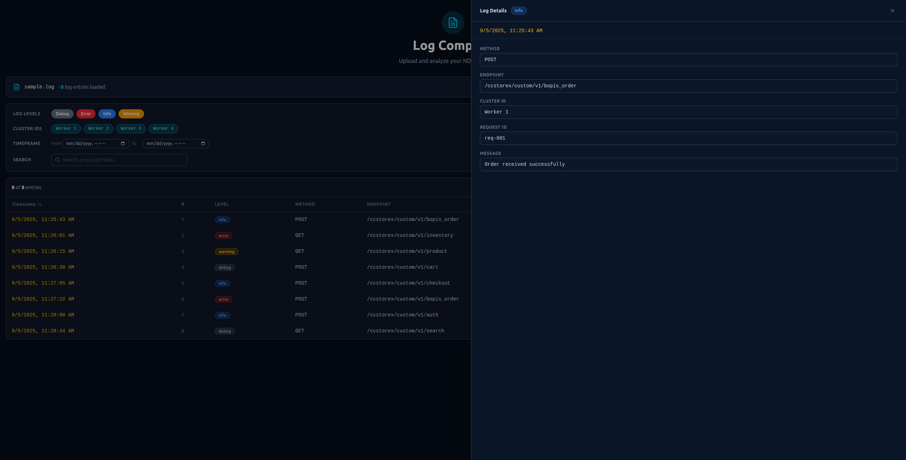

# Log Compiler

A browser-based tool for uploading and analyzing **NDJSON log files**. Load a `.log`, `.txt`, or `.json` file and interactively explore entries through filters, sorting, and a detail panel — all without sending data to any server.

---

## Screenshots

### Empty state — file upload



### Loaded state — log table with filters



### Row detail drawer



---

## Features

- **Drag-and-drop or click-to-browse** file upload (`.log`, `.txt`, `.json`).
- Parses **NDJSON** (newline-delimited JSON) files entirely in the browser.
- **Log table** with columns: Timestamp, #, Level, Method, Endpoint, Cluster ID, Request ID, Message.
- **Sortable timestamp** column (ascending / descending toggle).
- **Real-time filters**:
  - Log level toggle buttons (`info`, `error`, `warning`, `debug`).
  - Cluster ID toggle buttons (auto-generated from file contents).
  - Timeframe range pickers (From / To, 12-hour AM/PM format).
  - Free-text search across all fields.
- **Row detail drawer** — click any row to open a side panel with the full entry.
- **Download** button exports the currently filtered entries as NDJSON (`.log`).
- Fully **dark-themed** UI.

---

## Tech Stack

| Tool | Purpose |
|---|---|
| [React 19](https://react.dev) | UI framework |
| [TypeScript](https://www.typescriptlang.org) | Static typing |
| [Tailwind CSS v4](https://tailwindcss.com) | Utility-first styling |
| [Vite](https://vite.dev) | Dev server & bundler |
| [Biome.js](https://biomejs.dev) | Linting & formatting |
| [lucide-react](https://lucide.dev) | Icon library |

---

## Getting Started

```bash
# Install dependencies
npm install

# Start the development server
npm run dev

# Build for production
npm run build
```

---

## Expected Log Format

Files must contain one valid JSON object per line (NDJSON). Each entry should match the following schema:

```json
{
  "clusterId": "Worker 20",
  "endpoint": "/ccstorex/custom/v1/bopis_order",
  "level": "info",
  "message": "",
  "requestId": "",
  "requestMethod": "POST",
  "timestamp": "2025-09-05T14:25:43.179Z"
}
```

Accepted `level` values: `info`, `error`, `warning`, `debug`.

---

## Project Structure

```
src/
  components/       # UI components (header, table, drawer, filters…)
  hooks/            # Custom hooks (useLogFile, useLogFilters)
  types.ts          # Shared TypeScript types
  App.tsx
  main.tsx
docs/               # Requirements and screenshots
```

---

## Code Quality

```bash
npm run lint      # Run Biome linter
npm run format    # Format with Biome
npm run check     # Lint + format (auto-fix)
```

---

Made with ♥ by Claude
